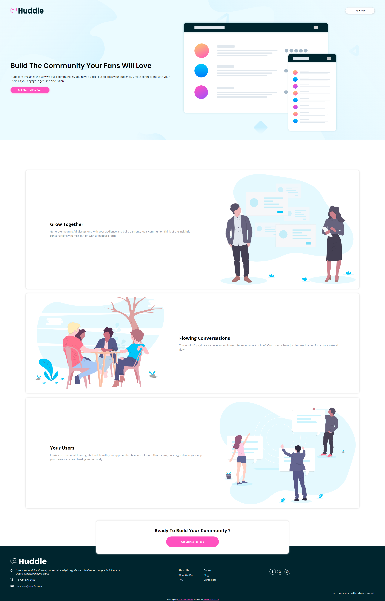

# Frontend Mentor - Huddle landing page with alternating feature blocks solution

This is a solution to the [Huddle landing page with alternating feature blocks challenge on Frontend Mentor](https://www.frontendmentor.io/challenges/huddle-landing-page-with-alternating-feature-blocks-5ca5f5981e82137ec91a5100). Frontend Mentor challenges help you improve your coding skills by building realistic projects. 

## Table of contents

- [Overview](#overview)
  - [The challenge](#the-challenge)
  - [Screenshot](#screenshot)
  - [Links](#links)
- [My process](#my-process)
  - [Built with](#built-with)
  - [What I learned](#what-i-learned)
  - [Useful resources](#useful-resources)
- [Author](#author)


## Overview

### The challenge

Users should be able to:

- View the optimal layout for the site depending on their device's screen size
- See hover states for all interactive elements on the page

### Screenshot



### Links

- Solution URL: [GitHub](https://github.com/CorentinTalour/clipboard-landing-page-master)
- Live Site URL: [GitHub.io](https://corentintalour.github.io/clipboard-landing-page-master/)

## My process

### Built with

- Semantic HTML5 markup
- SCSS
- Flexbox
- CSS Grid

### What I learned

CSS clamp

```scss
.proud-of-this-css {
  font-size: clamp(0.8rem, 3vw, 2.5rem);
}
```
CSS min()
```scss
.proud-of-this-css {
  margin: 0 min(8vw, 7rem) 0 min(8vw, 7rem);
}
```

### Useful resources

- [Frontend Mentor Rafael Dias](https://www.frontendmentor.io/solutions/huddlelandingpagewithblocksmaster-using-web-components-XuK1WV1QJN) - This solution taught me a lot about responsiveness
- [MDN Docs](https://developer.mozilla.org/en-US/) 


## Author

- Frontend Mentor - [@Corentin Talour](https://www.frontendmentor.io/profile/CorentinTalour)